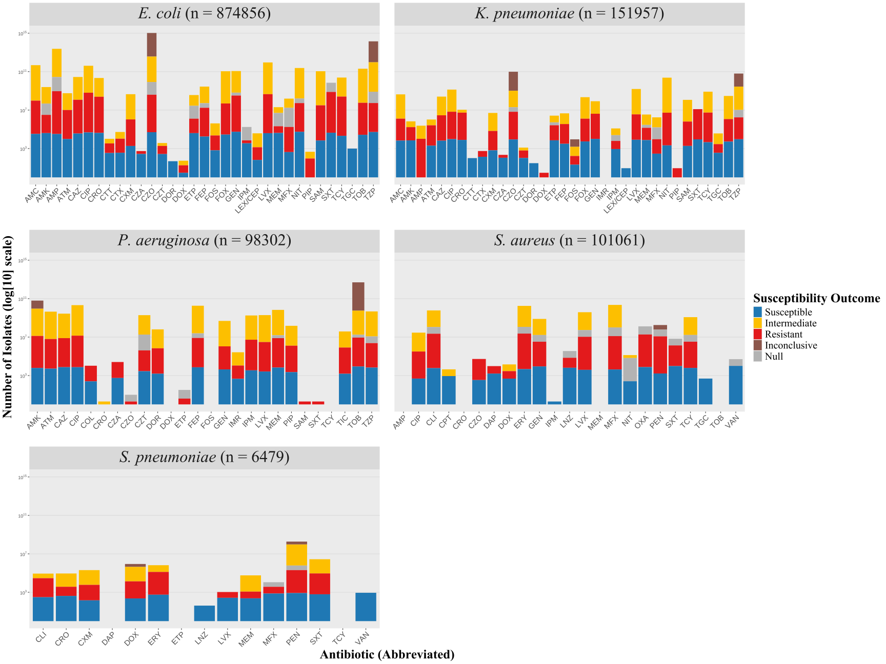
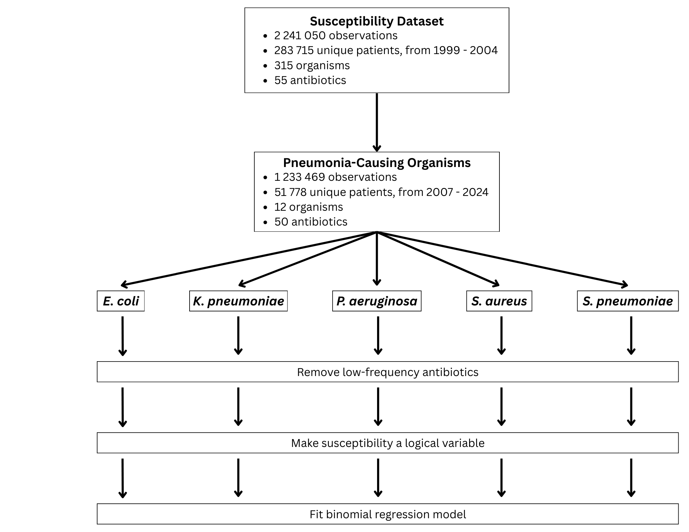

# AMR_REX25
Repository for URO REX project investigating AMR (anti-microbial resistance) trends in pneumonia-causing organisms. 

# Figures

(can also be found in the figures folder)

# Datasets

Source: [https://datadryad.org/dataset/doi:10.5061/dryad.jq2bvq8kp](https://datadryad.org/dataset/doi:10.5061/dryad.jq2bvq8kp)

- microbiology_culture_prior_infecting_organism.csv
- microbiology_cultures_antibiotic_class_exposure.csv
- microbiology_cultures_cohort.csv
- microbiology_cultures_comorbidity.csv
- microbiology_cultures_demographics.csv
- microbiology_cultures_labs.csv
- microbiology_cultures_microbial_resistance.csv
- microbiology_cultures_prior_med.csv
